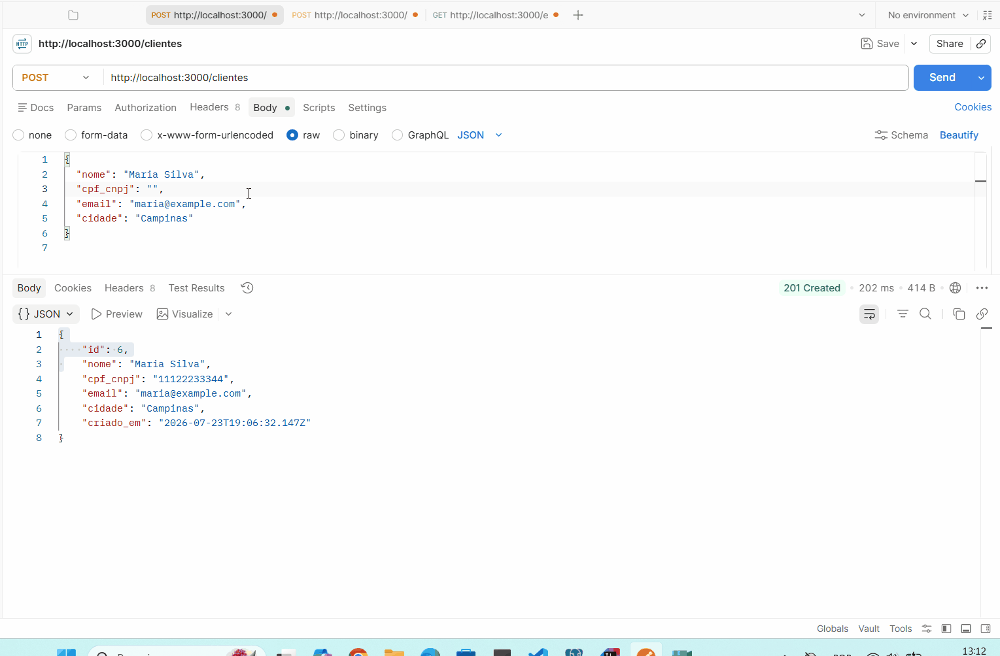
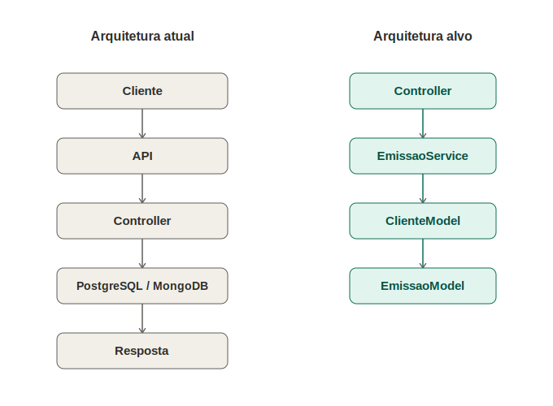

# Simulador de Emissão de NFS-e


API que simula o ciclo de emissão de uma Nota Fiscal de Serviço Eletrônica (NFS-e), construída para explorar, na prática, o tipo de problema de integração fiscal enfrentado por empresas do setor.



## Motivação

Diferente da NF-e (padronizada nacionalmente via SEFAZ), a NFS-e é regulada por cada município, o que gera fragmentação de layouts e formatos de retorno. Este projeto simula esse comportamento: cada tentativa de emissão pode retornar em um formato diferente, dependendo do status (autorizada, rejeitada, denegada).

## O que este projeto demonstra

Este projeto foi desenvolvido para praticar conceitos encontrados em integrações fiscais reais, incluindo:

- Arquitetura REST
- Integração entre bancos SQL e NoSQL
- Modelagem de dados híbrida
- Organização em camadas
- Simulação de regras de negócio
- Persistência de histórico
- APIs escaláveis

## Arquitetura



```
Cliente
  ↓
API (Express)
  ↓
Controller
  ↓
Service (regra de negocio)
  ↓
Model (ClienteModel / EmissaoModel)
  ↓
PostgreSQL / MongoDB
```

> A camada de Service isola a regra de negócio do Controller. Assim, se `simularRetornoFiscal()` for substituída por uma integração real com uma prefeitura (SOAP, certificado digital, autenticação, XML), o Controller não precisa mudar — toda a complexidade fica concentrada no `EmissaoService`.

## Fluxo da emissão

1. Cliente envia `POST /emissoes` com `clienteId` e `valor`
2. Controller recebe a requisição e repassa ao Service
3. Service busca o cliente no PostgreSQL
4. Service simula o retorno fiscal (status sorteado: autorizada, rejeitada ou denegada)
5. Resultado da emissão é persistido no MongoDB (histórico)
6. Resposta é retornada ao cliente

## Stack e arquitetura

- **Node.js + TypeScript** — API REST com Express
- **PostgreSQL** — armazena dados estruturados e fixos (cadastro de clientes/emitentes)
- **MongoDB** — armazena o histórico de emissões, já que cada status retorna campos diferentes (uma autorização tem `protocolo`; uma rejeição tem `codigoErro` e `motivo`). Modelar isso em tabelas relacionais geraria colunas majoritariamente vazias — um modelo de documento se encaixa melhor.

```
src/
  config/       conexões com Postgres/MongoDB, logger e Swagger
  models/       acesso a dados (queries e schemas do Mongoose)
  services/     regras de negócio (ex: EmissaoService)
  controllers/  recebe a requisição e repassa ao service/model
  schemas/      validação de entrada com Zod
  middlewares/  validação de request e tratamento global de erros
  errors/       classes de erro da aplicação (404, 400, 409...)
  routes/       definição dos endpoints
  app.ts        configuração do Express (middlewares, rotas, swagger)
  server.ts     ponto de entrada da aplicação
```

## Como rodar localmente

**Pré-requisitos:** Node.js 18+, PostgreSQL, e uma instância MongoDB (local ou Atlas).

```
npm install
cp .env.example .env   # preencha com suas credenciais
npm run dev
```

O servidor sobe em `http://localhost:3000` e cria automaticamente a tabela `clientes` no PostgreSQL na primeira execução.

### Rodando com Docker

Alternativa que já sobe a API, o PostgreSQL e um MongoDB local, sem precisar instalar nada além do Docker:

```
cp .env.example .env
docker compose up
```

Se preferir usar o MongoDB Atlas em vez do Mongo local do compose, mantenha a `MONGO_URI` do Atlas no `.env` normalmente.

## Documentação interativa (Swagger)

Com o servidor rodando, a documentação de todos os endpoints (com exemplos de request/response) fica disponível em:

```
http://localhost:3000/docs
```

## Endpoints

**Health**

```
GET    /ping     verifica se a API esta no ar
GET    /health   verifica a saude da API e das conexoes com Postgres/MongoDB
```

**Clientes**

```
POST   /clientes        cria um cliente
GET    /clientes        lista todos os clientes
GET    /clientes/:id    busca cliente por id
```

**Emissões**

```
POST   /emissoes             simula a emissão de uma nota (status sorteado)
GET    /emissoes/:clienteId  histórico de emissões de um cliente
```

Exemplo de criação de cliente:

```
POST /clientes
{
  "nome": "Empresa Teste LTDA",
  "cpf_cnpj": "12345678000199",
  "email": "contato@teste.com",
  "cidade": "Campinas"
}
```

Exemplo de emissão:

```
POST /emissoes
{
  "clienteId": 1,
  "valor": 1500.00
}
```

## Próximos passos

- Validação real de formato de CPF/CNPJ (algoritmo de dígito verificador, hoje só valida tamanho)
- Cobertura de testes automatizados para as rotas de `/clientes` (hoje só `/emissoes` tem testes)
- Interface desktop em Delphi para cadastro de clientes, conectada ao mesmo banco PostgreSQL